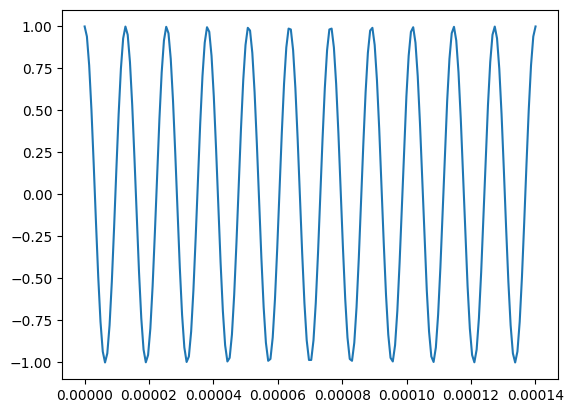
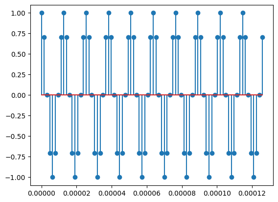
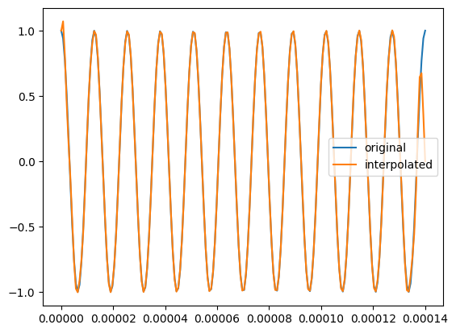
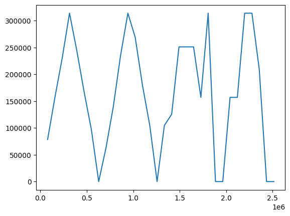

---
jupyter:
  kernelspec:
    display_name: Python 3
    language: python
    name: python3
  language_info:
    codemirror_mode:
      name: ipython
      version: 3
    file_extension: .py
    mimetype: text/x-python
    name: python
    nbconvert_exporter: python
    pygments_lexer: ipython3
    version: 3.10.4
  nbformat: 4
  nbformat_minor: 2
  orig_nbformat: 4
  vscode:
    interpreter:
      hash: dd8ba483ed0f5cc2331ae84b8296025ff9b628a8b05597d7974093fc941cb3ca
---

::: {.cell .code execution_count="1"}
``` python
import pandas as pd
import numpy as np
import matplotlib.pyplot as plt
from scipy.fft import fft, fftfreq
```
:::

::: {.cell .markdown}
# Завдання

## варіант

13 `<br>`{=html} **частота дискретизації** 100 000 Гц = 100 КГц
`<br>`{=html} **Розрядність представлення відліків сигналу, біт** 8 біт
`<br>`{=html} **Параметр А випадкового сигналу** 0.5 `<br>`{=html}
**Параметр B випадкового сигналу** 1 `<br>`{=html} Вивчається
дискретизація гармонічного сигналу. Його частота в послідовних
випробуваннях змінюється від fmin=Fs/8 до fmax=4Fs з кроком df=Fs/8.
:::

::: {.cell .markdown}
## Хід роботи
:::

::: {.cell .markdown}
### 1. Побудувати графік аналогового сигналу на інтервалі 2-3 періоди сигналу, використовуючи функцію plot. {#1-побудувати-графік-аналогового-сигналу-на-інтервалі-2-3-періоди-сигналу-використовуючи-функцію-plot}
:::

::: {.cell .code execution_count="2"}
``` python
# constants, functions and utils
NUM_OF_PERIODS_FOR_ANALOGUE = 11
NUM_OF_PERIODS_FOR_SAMPLING = 5
NUM_OF_DOTS_PER_PERIOD_RESTORED = 5
F_S = 100000*2*np.pi
F_CONST = F_S/8
A = 0.5
B = 1
NUM_OF_BITS = 8

def function(t,f):
    return np.cos(t*np.pi*2*f) #+ np.cos(t*np.pi*2*f/2) + np.cos(t*np.pi*2*f/3)

FUNCTION =np.vectorize(function)
```
:::

::: {.cell .code execution_count="3"}
``` python
fig,AX = plt.subplots(1,1)
def plot_signal(num_of_periods,F,ax=AX,plot=True,return_values=False):
    T = 1/F
    numb_of_samples_per_period = 200
    num_samples = num_of_periods*numb_of_samples_per_period
    #print(f'F: {F}, T: {T},num_samples: {num_samples}')
    data_X = np.linspace(0,num_of_periods*T,numb_of_samples_per_period)
    data_Y = FUNCTION(data_X,F)
    if plot:
        ax.plot(data_X,data_Y,label='original')
    if return_values:
        return data_X,data_Y


plot_signal(NUM_OF_PERIODS_FOR_ANALOGUE,F_CONST)
```

::: {.output .display_data}

:::
:::

::: {.cell .markdown}
### 2. Використовуючи функцію stem, побудувати графік дискретизованого сигналу в тих же координатах. {#2-використовуючи-функцію-stem-побудувати-графік-дискретизованого-сигналу-в-тих-же-координатах}
:::

::: {.cell .code execution_count="4"}
``` python
fig,AX = plt.subplots(1,1)
def plot_discrete_signal(num_periods,Fs,F,ax=AX,plot=True,return_values=False):
    T = 1/F
    Ts = 1/Fs
    #print(f'F: {F},T: {T}')
    data_X = np.arange(0*T,num_periods*T,Ts)
    data_Y = FUNCTION(data_X,F)
    if plot:
        ax.stem(data_X,data_Y)
    if return_values:
        return data_X,data_Y


plot_discrete_signal(10,F_S,F_CONST)
```

::: {.output .display_data}

:::
:::

::: {.cell .markdown}
### 3. Побудувати графік відновленого аналогового сигналу по дискретним відлікам за допомогою ряду Котельникова. {#3-побудувати-графік-відновленого-аналогового-сигналу-по-дискретним-відлікам-за-допомогою-ряду-котельникова}
:::

::: {.cell .code execution_count="5"}
``` python
def create_restored_function(Fs,F,ax=AX):
    data_X,data_Y = plot_discrete_signal(11,Fs=Fs,F=F,ax=ax,plot=True,return_values=True)
    Ts = 1/Fs
    def restored_function_non_vectorized(t):
        res = 0
        for x,y in zip(data_X,data_Y):
            res += y * np.sinc((t-x)/Ts) ## Whittaker-Shannon interpolation 
        return res
    reconstructed_function = np.vectorize(restored_function_non_vectorized)
    return reconstructed_function,data_X,data_Y
```
:::

::: {.cell .code execution_count="6"}
``` python
reconstructed_function,data_X_sampled,data_Y_sampled = create_restored_function(F_S,F_CONST)
X_values,Y_values_original = plot_signal(num_of_periods=11,F=F_CONST,plot=False,return_values=True)
Y_values_interpolated = reconstructed_function(X_values)
fig,ax =plt.subplots()
ax.plot(X_values,Y_values_original,label='original')
ax.plot(X_values,Y_values_interpolated, label='interpolated')
ax.legend()
```

::: {.output .execute_result execution_count="6"}
    <matplotlib.legend.Legend at 0x1b1b71ac4c0>
:::

::: {.output .display_data}

:::
:::

::: {.cell .markdown}
### 4. Визначити частоту відновленого сигналу. {#4-визначити-частоту-відновленого-сигналу}
:::

::: {.cell .code execution_count="7"}
``` python
# Fast Fourier Transform
data_X,data_Y = plot_discrete_signal(11,Fs=F_S,F=F_CONST,plot=False,return_values=True)
yf = fft(data_Y)
xf = fftfreq(len(data_Y), 1 / F_S)
ind = np.argmax(yf)
print(f'Frequency estimated after sampling: {abs(xf[ind])}, original frequency: {F_CONST}, difference: {abs(abs(xf[ind])-F_CONST)}')
```

::: {.output .stream .stdout}
    Frequency estimated after sampling: 78539.81633974481, original frequency: 78539.81633974482, difference: 1.4551915228366852e-11
:::
:::

::: {.cell .markdown}
### 5. Побудувати графік залежності частоти відновленого сигналу від частоти початкового сигналу. Пояснити його форму. {#5-побудувати-графік-залежності-частоти-відновленого-сигналу-від-частоти-початкового-сигналу-пояснити-його-форму}
:::

::: {.cell .code execution_count="8"}
``` python
NUM_OF_ITERATIONS = 32
original_freq_range = np.linspace(F_S/8, 4*F_S, NUM_OF_ITERATIONS)
figs,axs = plt.subplots(32,1,figsize=(14,150))
estimated_frequences = []
for i,cur_F in enumerate(original_freq_range):
    cur_ax = axs[i]
    reconstructed_function,data_X_sampled,data_Y_sampled = create_restored_function(Fs=F_S,F=cur_F,ax=cur_ax)
    X_values,Y_values_original = plot_signal(num_of_periods=NUM_OF_PERIODS_FOR_ANALOGUE,F=cur_F,ax=cur_ax,plot=True,return_values=True)
    Y_values_interpolated = reconstructed_function(X_values)
    cur_ax.plot(X_values,Y_values_interpolated, label='interpolated')
    yf = fft(data_Y_sampled)
    xf = fftfreq(len(data_Y_sampled), 1 / F_S)
    ind = np.argmax(yf)
    estimated_frequence = abs(xf[ind])
    estimated_frequences.append(estimated_frequence)
    cur_ax.set_title(f'It {i} of {NUM_OF_ITERATIONS-1}. F: {cur_F}. Fs: {F_S}. Fs/F : {F_S/cur_F}')
    #print()
    #print(f'Frequency estimated after sampling: {estimated_frequence}, original frequency: {cur_F}, difference: {abs(abs(xf[ind])-F_CONST)}')
```

::: {.output .display_data}

:::
:::

::: {.cell .code execution_count="9"}
``` python
plt.plot(original_freq_range,estimated_frequences)
```

::: {.output .execute_result execution_count="9"}
    [<matplotlib.lines.Line2D at 0x1b1c139f490>]
:::

::: {.output .display_data}

:::
:::

::: {.cell .markdown}
1.  Згенерувати дискретний сигнал, отриманий шляхом дискретизації
    аналогового гармонічного сигналу с частотою 3Fs/5 і тривалістю,
    достатньою для обчислення статистичних параметрів і побудови
    гістограм.
:::

::: {.cell .markdown}
### 7. Виконати квантування дискретного сигналу, використовуючи округлення з кроком, який відповідає представленню відліків двійковими числами, розрядність яких задана в таблиці. {#7-виконати-квантування-дискретного-сигналу-використовуючи-округлення-з-кроком-який-відповідає-представленню-відліків-двійковими-числами-розрядність-яких-задана-в-таблиці}
:::

::: {.cell .markdown}
### 8. Обчислити похибку квантування. Розрахувати дисперсію, мінімальне і максимальне значення похибки. Порівняти отримані значення зі значеннями, обчисленими по формулам. Побудувати гістограму похибки (функция hist) і графік залежності похибки від часу. {#8-обчислити-похибку-квантування-розрахувати-дисперсію-мінімальне-і-максимальне-значення-похибки-порівняти-отримані-значення-зі-значеннями-обчисленими-по-формулам-побудувати-гістограму-похибки-функция-hist-і-графік-залежності-похибки-від-часу}
:::

::: {.cell .markdown}
### 9. Повтории п.п. 6-8 для сигналу з частотою Fs/sqrt(8). Порівняти розподіл похибки квантування з результатом п.3. Пояснити відмінності. {#9-повтории-пп-6-8-для-сигналу-з-частотою-fssqrt8-порівняти-розподіл-похибки-квантування-з-результатом-п3-пояснити-відмінності}
:::

::: {.cell .markdown}
### 10. Повторити п.п. 6-8 для нормального псевдовипадкового (середнєA, дисперсія D наведені в таблиці) сигналу, сформованого функцією normrnd. Порівняти розподіл похибки квантування з в пп.8, 9. {#10-повторити-пп-6-8-для-нормального-псевдовипадкового-середнєa-дисперсія-d-наведені-в-таблиці-сигналу-сформованого-функцією-normrnd-порівняти-розподіл-похибки-квантування-з-в-пп8-9}
:::

::: {.cell .markdown}
### 11. Зробити висновки про характер похибки квантування і про справедливість теоретичної моделі похибки. {#11-зробити-висновки-про-характер-похибки-квантування-і-про-справедливість-теоретичної-моделі-похибки}
:::

::: {.cell .markdown}
## Prev code
:::

::: {.cell .code}
``` python
def restore_numpy_convolve(Fs,F,t):
    #N = 100
    T = 1/F
    Ts = 1/Fs
    data_X_s = np.arange(2*T,8*T,Ts)
    data_Y_s = np.cos(data_X_s*2*np.pi*F)
    sinc_component = np.sinc(np.pi*Fs*(t-data_X_s))
    res = np.convolve(data_Y_s,sinc_component,mode='valid')
    #intermediate_value_for_timestemp_t = np.dot(data_Y_s,sinc_component)
    #print(res,res2)
    #convolve_correct_size = len(res)//2
    #plt.plot(np.linspace(0,11*T,convolve_correct_size),res[:convolve_correct_size])
    #plt.plot(data_X_s,data_Y_s)
    #return intermediate_value_for_timestemp_t

def restore_own_convolve_implementation(Fs,F,ax):
    T = 1/F
    Ts = 1/Fs
    upper_boundary =11*T
    X_s = np.arange(0,upper_boundary,Ts)

    #X_r = np.arange(0,upper_boundary,step_size_restored)
    #len_X_r = len(X_r)
    
    Y_s = np.cos((X_s)*np.pi*2*F)

    sinc_component = np.sinc(np.pi*Fs*X_s)
    restored_full = np.convolve(sinc_component,Y_s,mode='full')

    #print(restored_full)
    #fig,ax = plt.subplots(1,1)
    

    #print(len_X_r)
    #print(len(X_s))
    #print(len(restored_full))
    ax.plot(X_s,restored_full[:len(X_s)],label='restored')
    #ax.plot(X_s,Y_s,label='original')
    #ax.plot(restored_full)
    #ax.legend()
    return X_s,restored_full,Y_s


X = np.linspace(0,NUM_OF_PERIODS_FOR_ANALOGUE*1/F_CONST,NUM_OF_PERIODS_FOR_ANALOGUE*10)
Y = []
for x in X:
   Y.append(restore_numpy_convolve(Fs=F_S,F=F_CONST,t=x))


fig,ax = plt.subplots(1,1)


#plt.plot(X,Y,':')
plot_signal(num_of_periods=NUM_OF_PERIODS_FOR_ANALOGUE,F=F_CONST,ax=ax)
restore_own_convolve_implementation(Fs=F_S,F=F_CONST,ax=ax)
ax.legend()
#restore_numpy_convolve(30,1,9.01)


X_s,restored_full,Y_s = restore_own_convolve_implementation(Fs=F_S,F=F_CONST,ax=ax)
#print(X_s)
print(np.mean(np.abs(restored_full[:len(Y_s)]-Y_s)))
```
:::
